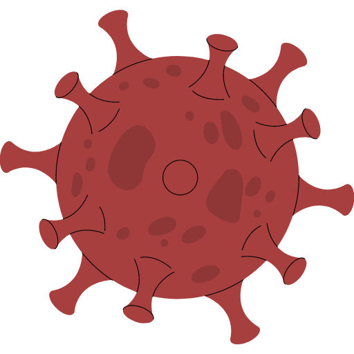
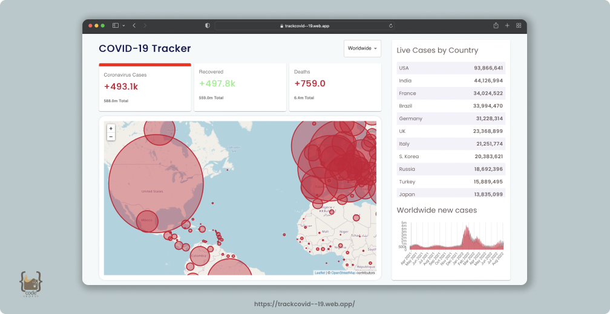

<h1 align="center">
  <br>
  <a href="http://www.amitmerchant.com/electron-markdownify"></a>
  <br>
  Covid-19 Tracker
  <br>
</h1>

<h4 align="center">A website that gives live informations of Covid-19 cases across different countries.</h4>

<p align="center">
  <a href="#overview">Overview</a> •
  <a href="#built-with">Build with</a> •
  <a href="#links">Live links</a> •
  <a href="#how-to-use">How to use</a> •
  <a href="#issues-solved">Issues solved</a>
</p>

<h5 align="center">Don't forget to give a ⭐️ </h5>

<hr>



## Overview

### The challenge

Users should be able to:

- View the optimal layout for the app depending on their device's screen size.
- Get details of live covid cases - live cases, recovered and death details.
- See relevant covid-19 information based on your search.
- Graphical representaion of 120 days based on your search.
- Researched `Components` in Material UI and `Emmet` cheat sheats .

## Built with

- [![Reactjs][reactjs]][reactjs-url] [![MaterialUI][materialui]][materialui-url] 
- [![disease.sh][disease.sh]][disease.sh-url] [![BEM Methodology][bem methodology]][bem methodology-url]
- [![Chartjs][chartjs]][chartjs-url] [![Leaflet][leaflet]][leaflet-url]

## How To Use

To clone and run this application, you'll need [Git](https://git-scm.com) and [Node.js](https://nodejs.org/en/download/) (which comes with [npm](http://npmjs.com)) installed on your computer. From your command line:

```bash
# Clone this repository
$ git clone https://github.com/hafizmp/covid-19-tracker.git

# Go into the repository
$ cd covid-19-tracker

# Install dependencies
$ npm install

# Run the app
$ npm start
```

> **Note**
> If you're using Linux Bash for Windows, [see this guide](https://www.howtogeek.com/261575/how-to-run-graphical-linux-desktop-applications-from-windows-10s-bash-shell/) or use `node` from the command prompt.

## Links

- Solution URL: [GitHub](https://github.com/hafizmp/covid-19-tracker)
- Live Site URL: [Covid-19 Tracker](https://trackcovid--19.web.app/)

<hr>

## Issues Solved

<h4 align="center">Try to install the required dependency of the following version if you face any issues while running the code.</h4>
<p align="center">
    
</p>
<br>

## - To downgrade a npm dependencies to specific version 👇

```bash
# reinstall the npm dependacy
$ npm install <package>@<version>

# Example
$ npm i chart.js@2.9.3 react-chartjs-2@2.9.0 leaflet@1.6.0  react-leaflet@1.6.0 numeral@2.0.6

# Run the app
$ npm start

```

[reactjs]: https://img.shields.io/badge/REACT%20JS-000000?style=for-the-badge&logo=REACT&logoColor=61DBFB
[reactjs-url]: https://reactjs.org/
[materialui]: https://img.shields.io/badge/Material%20UI-293462?style=for-the-badge&logo=mui&logoColor=E7F6F2
[materialui-url]: https://mui.com/
[leaflet]: https://img.shields.io/badge/Leaflet.js-A2B5BB?style=for-the-badge&logo=leaflet&logoColor=2B7A0B
[leaflet-url]: https://leafletjs.com/
[chartjs]: https://img.shields.io/badge/Chart.js-FFFFFF?style=for-the-badge&logo=chart.js&logoColor=ff787c
[chartjs-url]: https://www.chartjs.org/
[bem methodology]: https://img.shields.io/badge/BEM%20Methodology-062433?style=for-the-badge&logo=BEM&logoColor=16a1e6
[bem methodology-url]: https://api.github.com/
[disease.sh]: https://img.shields.io/badge/disease.sh%20API%20-FF8FB1?style=for-the-badge&logo=&logoColor=61DBFB
[disease.sh-url]: https://disease.sh/docs/
